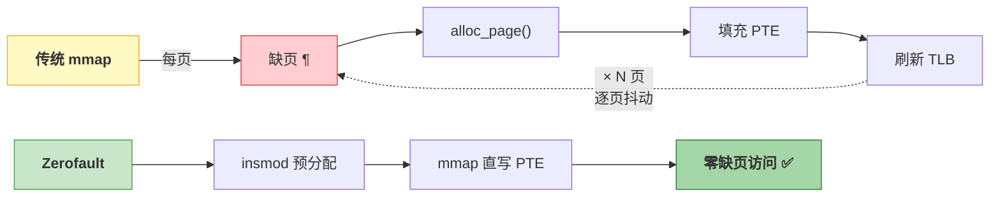
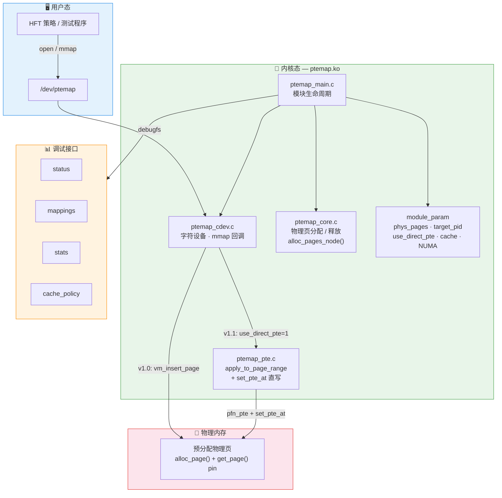
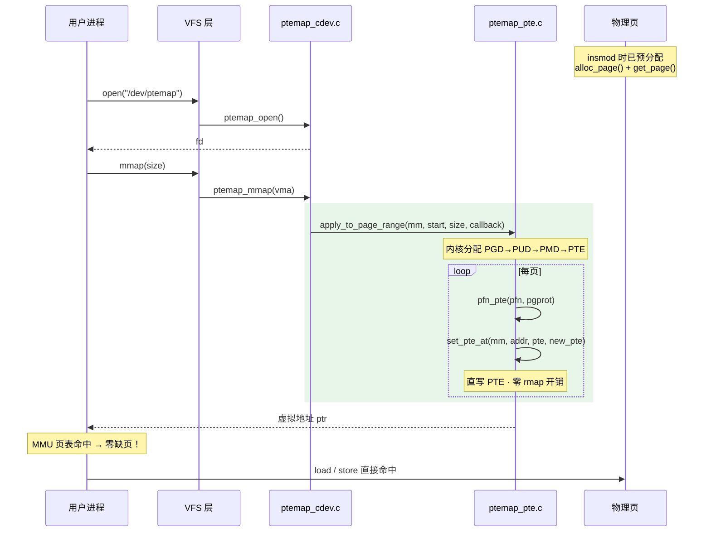
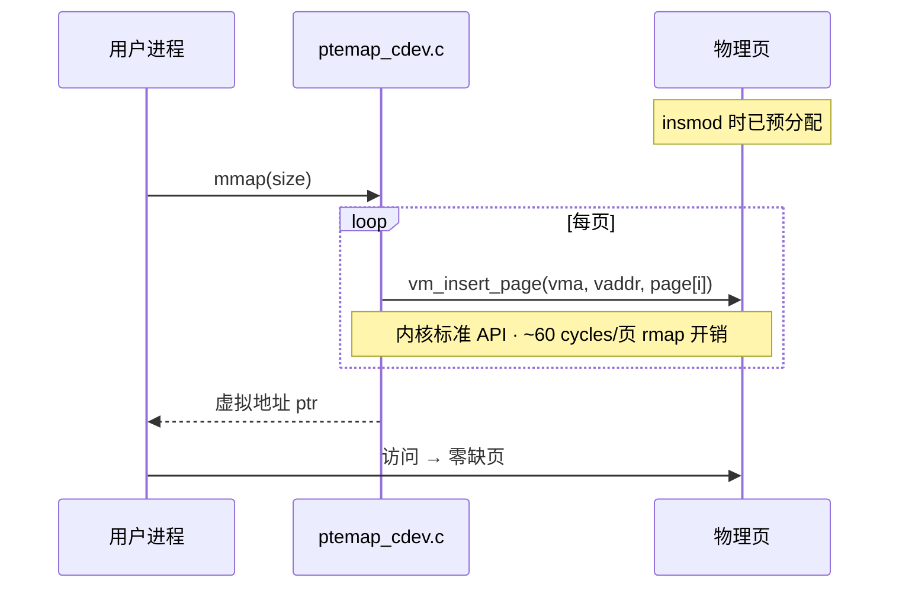
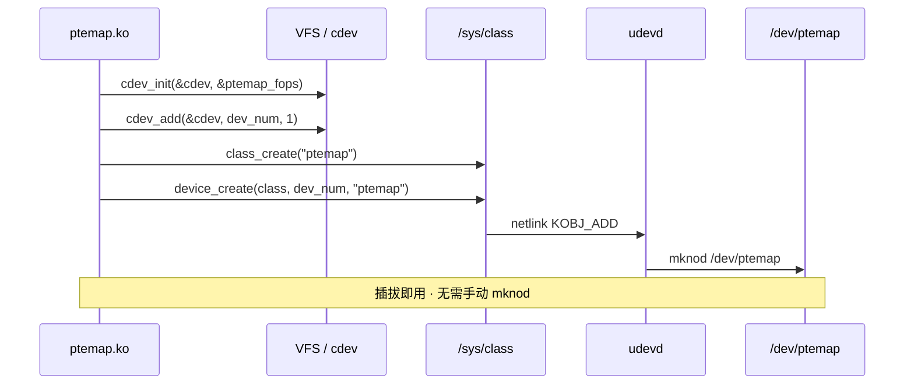
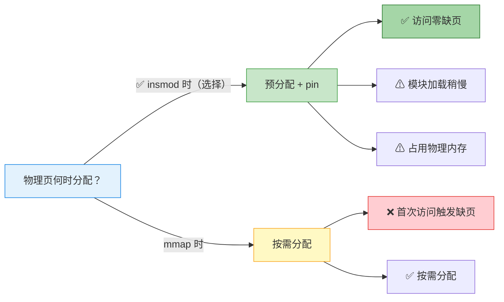

# Zerofault

> 预分配物理页 + mmap 直写 PTE → 零缺页、低延迟的 Linux 内核内存映射模块

[](https://kernel.org)
[](LICENSE)
[]()
[]()

---

## 一句话理解

传统 `mmap` 在首次访问每页时触发缺页中断——对高频交易等低延迟场景不可接受。Zerofault 在 `insmod` 时预分配全部物理页并 pin 住，`mmap` 时一次性建立所有 PTE，用户态访问**永不缺页**。



### QEMU 实测对比 (256 × 4KB)

| 策略 | mmap 延迟 | 首次访问 | **总计** | 缺页次数 |
|------|----------|---------|---------|---------|
| MAP_ANONYMOUS | 14 µs | 2,261 µs | 2,276 µs | 256 |
| MAP_POPULATE | 5,702 µs | 491 µs | 6,193 µs | 0 |
| **Zerofault** | 690 µs | **188 µs** | **879 µs** | **0** |

> Zerofault 的 mmap + 首次访问总延迟比传统 mmap 快 **2.6×**，且零缺页。

---

## 架构总览



---

## mmap 流程

### 推荐路径：v1.1 PTE 直写



### 兼容路径：v1.0 vm_insert_page



---

## 源码结构

| 文件 | 行数 | 职责 |
|------|:----:|------|
| `ptemap_main.c` | 253 | init：参数校验 → 进程查找 → 页分配 → cdev → debugfs；exit：逆序清理 + PTE/PMD 回滚 |
| `ptemap_core.c` | 171 | 物理页预分配 / 释放、cache 数组管理、huge page pgprot 转换、`alloc_time_ns` 计时 |
| `ptemap_cdev.c` | 390 | `/dev/ptemap` 字符设备：open (PID 访问控制)、mmap (三路径调度)、ioctl (QUERY / TLB)、多进程追踪 |
| `ptemap_pte.c` | 387 | PTE 直写 + PMD 大页映射 + 逐页 cache + TLB flush + 模块卸载 PTE/PMD 清除 |
| `ptemap_debugfs.c` | 272 | debugfs：`status` / `mappings` / `stats` / `cache_policy`（可读写） |
| `ptemap_core.h` | 129 | 全局状态结构体 + API 声明 + cache 枚举 + huge_page 字段 |
| `ptemap.h` | 91 | UAPI 头文件：ioctl 命令号 + 数据结构，用户态 `#include "ptemap.h"` |
| `test_ptemap.c` | 384 | 功能测试：mmap → 读写验证 → 边界检测 → ioctl 查询 → TLB flush |
| `bench_ptemap.c` | 968 | 性能基准：mmap 延迟 / 首次访问 / 读写吞吐 / ioctl 延迟 / cache 模式对比 / compare 模式 |
| **合计** | **3,045** | |

---

## 模块参数

| 参数 | 类型 | 默认值 | 说明 |
|------|:----:|--------|------|
| `phys_pages` | int | 256 | 预分配物理页数量 (256 = 1MB) |
| `target_pid` | int | 0 | 允许访问的 PID (0 = 任意进程) |
| `use_direct_pte` | int | 0 | PTE 直写模式: `0`=vm_insert_page, `1`=apply_to_page_range+set_pte_at |
| `huge_page` | int | 0 | 大页模式: `0`=4KB, `2`=2MB PMD huge page |
| `default_cache` | string | WC | 全局 cache 策略: `WC`, `WB`, `UC`, `WT` |
| `numa_node` | int | -1 | NUMA 节点: `-1`=任意, `≥0`=绑定到指定节点 |

```sh
# PTE 直写（推荐）
insmod ptemap.ko phys_pages=512 use_direct_pte=1

# 2MB 大页（减少 TLB miss）
insmod ptemap.ko phys_pages=4 huge_page=2 use_direct_pte=1

# Write-Back cache + NUMA node 0
insmod ptemap.ko phys_pages=256 default_cache=WB numa_node=0 use_direct_pte=1
```

---

## 性能基准

```sh
# Zerofault 完整基准
insmod ptemap.ko phys_pages=256 use_direct_pte=1
bench_ptemap zerofault 256

# 对比所有策略
bench_ptemap compare 256

# 传统 mmap 对比（需先 rmmod）
rmmod ptemap
bench_ptemap anon 256      # MAP_ANONYMOUS
bench_ptemap populate 256  # MAP_POPULATE
```

<details>
<summary>📊 QEMU benchmark 完整输出示例</summary>

```
=== bench_ptemap v1.0 ===
mode: zerofault (direct PTE) | 256 pages | 1024 KB | WC | iter=10

--- mmap latency ---
  page_faults: delta=0  [PASS]
  mmap (ns)          min=599,354  max=1,524,129  avg=1,085,675  median=1,309,758

--- first-access latency ---
  page_faults: delta=0  [PASS]
  first-read          min=617  max=51,760  avg=3,108  median=3,108  ns
  >1us outliers: 241 / 256 pages (94.1%)

--- read throughput ---
  min=940  max=1,501  avg=1,259  median=1,337  MB/s

--- write throughput ---
  min=920  max=1,088  avg=978  median=926  MB/s

--- ioctl latency (1000×) ---
  QUERY single       min=2,250  avg=3,796  median=2,351  ns
  QUERY_RANGE batch  min=22,403 avg=27,888 median=23,329 ns
  FLUSH_TLB          min=33,529 avg=42,669 median=34,321 ns

--- cache mode comparison ---
  mode  read(MB/s)  write(MB/s)
  WC    1,376       1,502
  WB    1,005       1,769
  UC    1,071       1,336
  WT    857         1,488

--- kernel stats (debugfs) ---
  alloc_time_ns:  556,002
  mmap_time_ns:   463,327
  mmap_count:     20
```
</details>

---

## 设备模型

ptemap 将预分配物理内存包装为字符设备，用户态通过标准文件操作访问。

### cdev 注册 → /dev/ptemap 自动创建



### 系统调用 → 内核回调路由

| 用户态操作 | 内核路由 | 模块回调 | 效果 |
|-----------|---------|---------|------|
| `open("/dev/ptemap")` | VFS → cdev | `ptemap_open()` | PID 访问控制 |
| `mmap(fd)` | VFS → cdev | `ptemap_mmap()` → `ptemap_mmap_direct()` | 直写 PTE |
| `ioctl(fd, QUERY)` | VFS → cdev | `ptemap_ioctl()` → `ptemap_ioctl_query()` | 查询 PFN/VA/cache |
| `close(fd)` | VFS → cdev | `ptemap_release()` | 清理追踪数据 |

> **本质**：ptemap 没有真实硬件 —— 它把内核预分配物理页通过 cdev 暴露为「内存设备」。`ptr = mmap(fd)` 返回的 VA 由模块直写 PTE 指向预分配物理页，此后 load/store 直接命中，全程不经过内核。

---

## 关键设计决策



| 决策 | 选择 | 理由 |
|------|------|------|
| 物理页分配时机 | **insmod 时** | 避免 mmap 后首次访问的缺页延迟抖动 |
| 页映射方式 (v1.1) | **apply_to_page_range + set_pte_at** | 直写 PTE · 零 rmap 开销 · 逐页独立 pgprot |
| Cache 策略 | **WC 默认 · 逐页可配** | WC 折中延迟与吞吐；debugfs / ioctl 查设 WB / UC / WT |
| Cache 生效时机 | **mmap 时一锤定音** | 运行时热切需 TLB shootdown + cache flush，HFT 不接受 |
| 调试接口 | **debugfs** | 无 API 兼容性承诺 · 适合快速迭代 |

---

## 版本演进

| 版本 | 核心交付 |
|------|---------|
| v1.0 | 模块生命周期 · 物理页预分配/pin · cdev + mmap (`vm_insert_page`) · debugfs |
| v1.1 | PTE 直写 (`apply_to_page_range` + `set_pte_at`) · 双路径可切换 |
| v1.2 | 逐页 cache 策略 (WC/WB/UC/WT) · debugfs `cache_policy` |
| v1.3 | ioctl 查询 + TLB flush · 模块卸载 PTE 回滚安全机制 |
| v1.4 | 2MB PMD 大页 · THP 兼容 · 动态 page_size 检测 |
| v1.5 | `default_cache` 参数 · NUMA 感知 (`alloc_pages_node`) · 多进程共享 |
| v1.6 | `bench_ptemap` 性能基准 · 内核计时统计 (`alloc_time_ns`/`mmap_time_ns`) |

---

## 编译 & 测试

```sh
# 编译
cd ptemap && make KERNELDIR=/path/to/kernel/build

# 加载
insmod ptemap.ko phys_pages=256 use_direct_pte=1

# 调试
cat /sys/kernel/debug/ptemap/status

# 功能测试
test_ptemap 64

# 性能基准
bench_ptemap zerofault 256

# 卸载
rmmod ptemap
```

<details>
<summary>🔧 内核配置要求</summary>

| 配置项 | 要求 | 说明 |
|--------|:----:|------|
| `CONFIG_TRANSPARENT_HUGEPAGE` | `=y` | `zap_huge_pmd()` 正确处理 PMD 大页 munmap，消除 `bad pmd` 警告 |
| `CONFIG_TRANSPARENT_HUGEPAGE_MADVISE` | 推荐 | 按需启用 THP，不影响全局 |

</details>

---

## License

GPL-2.0
