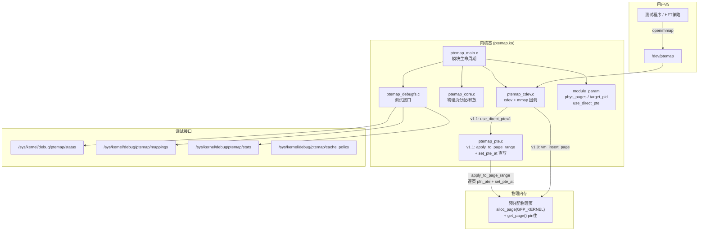
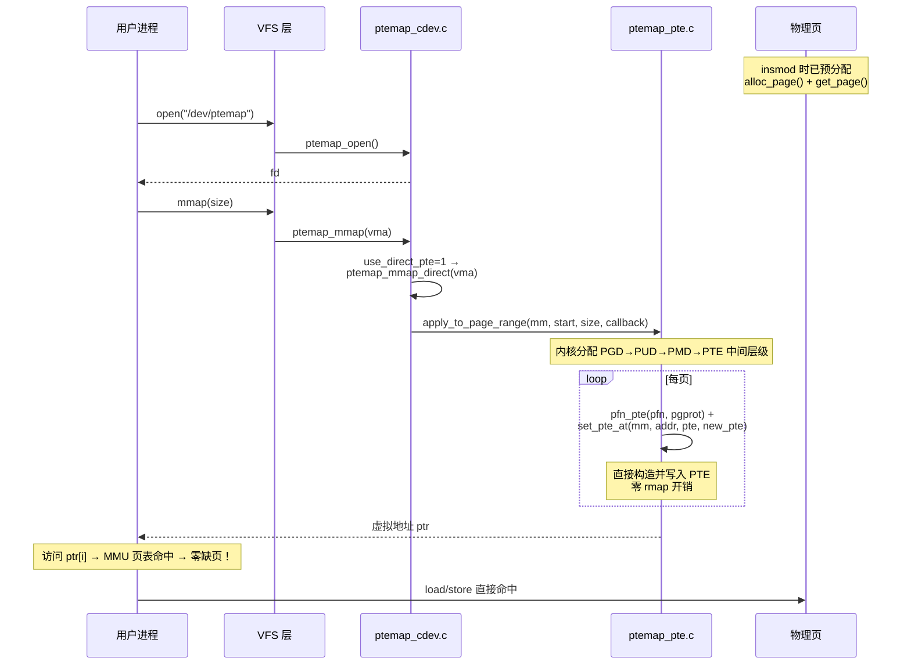
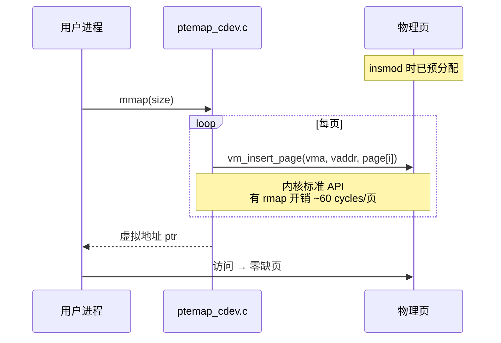
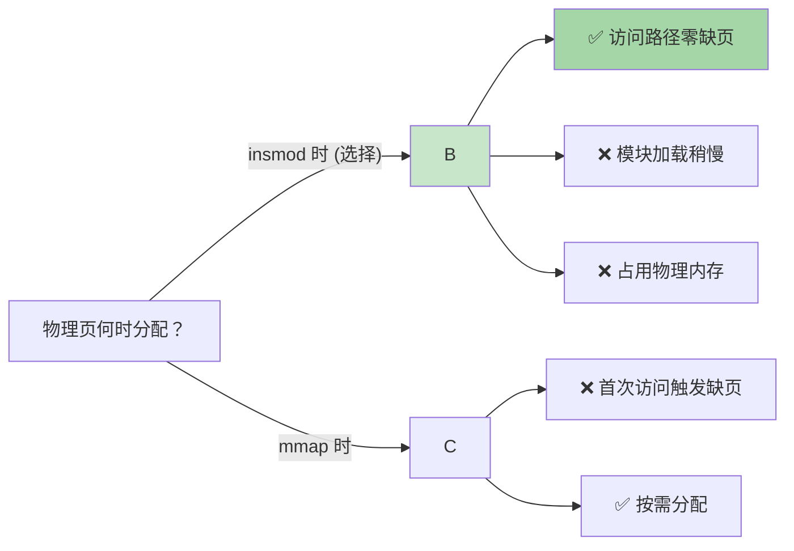

# Zerofault

> 预分配物理页 + 一次 mmap 建立直接映射 → 用户态零缺页访问的 Linux 内核模块

[](https://kernel.org)
[](LICENSE)
[]()
[]()

---

## 解决什么问题

普通 `mmap` 在首次访问每页时触发缺页中断（page fault），逐页分配物理内存并填充 PTE——这对高频交易等低延迟场景不可接受。Zerofault 在 `insmod` 时一次性预分配所有物理页并 pin 住，`mmap` 时直接建立全部映射，用户态访问永不缺页。

```
传统 mmap:  mmap→[缺页→alloc→建PTE→TLB] × N页  (逐页，抖动)
Zerofault:  insmod[预分配全部物理页] → mmap[一次建PTE] → 零缺页访问
```

## 架构总览



## mmap 流程

### v1.1 PTE 直写（默认推荐）



### v1.0 vm_insert_page（兼容保留）



## 源码结构

| 文件 | 行数 | 职责 |
|------|------|------|
| `ptemap_main.c` | 202 | 模块生命周期：init 参数校验 → 找目标进程 → 分配页+缓存数组 → 注册 cdev → 创建 debugfs；exit 逆序清理 + PTE/PMD 回滚 |
| `ptemap_core.c` | 147 | 物理页管理：预分配/释放 (`alloc_page`+`get_page`/`free_reserved_page`/`__free_pages`)，Per-page 缓存策略数组，huge page pgprot 转换 |
| `ptemap_cdev.c` | 314 | `/dev/ptemap` 字符设备：open（访问控制）、mmap（v1.0/v1.1/v1.4 huge 调度）、ioctl（QUERY/QUERY_RANGE/FLUSH_TLB，page_size 感知） |
| `ptemap_pte.c` | 352 | v1.1 PTE 直写 + v1.2 逐页 cache + v1.3 TLB flush + v1.3.1 PTE 清除 + v1.4 PMD 大页映射与清除 |
| `ptemap_debugfs.c` | 285 | 4 个 debugfs 文件：`status`、`mappings`、`stats`、`cache_policy`（rw，动态页大小标签） |
| `ptemap_core.h` | 104 | 全局状态结构体 + API 声明 + cache 枚举 + huge_page/page_size/page_order 字段 |
| `ptemap.h` | 93 | UAPI 头文件：ioctl 命令号 + 数据结构（含 page_size 输出字段），用户态 `#include "ptemap.h"` |
| `test_ptemap.c` | 325 | 用户态测试：open → ioctl 检测 page_size → mmap → 写/读验证 → 跨页边界 → ioctl QUERY/QUERY_RANGE/FLUSH_TLB |
| **合计** | **1820** | |

## 模块参数

| 参数 | 类型 | 默认值 | 说明 |
|------|------|--------|------|
| `phys_pages` | int | 256 | 预分配物理页数量（256 = 1MB） |
| `target_pid` | int | 0 | 允许访问的进程 PID（0 = 任意进程） |
| `use_direct_pte` | int | 0 | PTE 直写模式：0=vm_insert_page(v1.0) 1=apply_to_page_range+set_pte_at(v1.1) |
| `huge_page` | int | 0 | 大页模式：0=4KB(默认) 2=2MB PMD-level huge pages |
| `default_cache` | string | WC | 全局默认 cache 策略：WC(默认), WB, UC, WT |
| `numa_node` | int | -1 | NUMA 节点绑定：-1=任意(默认), >=0 绑定到指定节点 |

```sh
# v1.0 默认路径（vm_insert_page）
insmod ptemap.ko phys_pages=512 target_pid=0

# v1.1 PTE 直写路径（apply_to_page_range，零 rmap）
insmod ptemap.ko phys_pages=512 use_direct_pte=1

# v1.4 2MB huge page 路径（PMD 级大页，减少 TLB miss）
insmod ptemap.ko phys_pages=4 huge_page=2 use_direct_pte=1

# v1.5 全局默认 WB cache（免除 debugfs 手动设置）
insmod ptemap.ko phys_pages=256 default_cache=WB use_direct_pte=1

# v1.5 NUMA 节点绑定（将物理页固定在 node 0）
insmod ptemap.ko phys_pages=256 numa_node=0 use_direct_pte=1
```

## 编译 & 测试

**前置条件**：Linux 6.16.2 内核编译环境，`KERNELDIR` 指向 pre-built kernel tree。

```sh
# ===== 编译 =====
cd ptemap
make KERNELDIR=/path/to/kernel/build

# ===== 加载 =====
insmod ptemap.ko phys_pages=256

# ===== 调试查看 =====
cat /sys/kernel/debug/ptemap/status
#  state:     LIVE
#  version:   1.3.0
#  pages:     256 (total)
#  size:      1048576 bytes (1 MB)
#  target_pid: 0
#  direct_pte: 1 (PTE direct write)
#  vaddr:     0x7f...-0x7f...
#  tlb_flush: 0

cat /sys/kernel/debug/ptemap/cache_policy
#  pages count  mode
#  ----- ------ ------
#  all   256    WC

echo "0-63 WB" > /sys/kernel/debug/ptemap/cache_policy
#  → 前 64 页切换为 Write-Back

cat /sys/kernel/debug/ptemap/mappings
#  idx   vaddr              pfn                 size
#  ----- ------------------ ------------------ ----------
#  0     0x00007f...        0x0000000000123abc 4KB
#  ...

# ===== 运行测试（v1.1 直写路径）=====
insmod ptemap.ko phys_pages=256 use_direct_pte=1
./test_ptemap 64
#  === ptemap test ===
#  device:    /dev/ptemap
#  nr_pages:  64 (256 KB)
#  [1] open  OK (fd=3)
#  ptemap: mmap DIRECT OK: vaddr=0x7f...-0x7f... pages=64 pid=61
#  [2] mmap OK (vaddr=0x7f..., size=256 KB)
#  [3] writing pattern...
#  [3] write OK (64 pages)
#  [4] verifying...
#  [4] verify OK (0 errors)
#  [5] cross-page boundary test...
#  [5] boundary OK
#  --- ioctl QUERY test ---
#    page[  0] pfn=0x5002 vaddr=0x7fc14036c000 cache=0
#    page[  1] pfn=0x4ffb vaddr=0x7fc14036d000 cache=0
#    ...
#  QUERY OK (0 errors)
#  --- ioctl QUERY_RANGE test ---
#  QUERY_RANGE OK (64 pages, 0 errors)
#  --- ioctl FLUSH_TLB test ---
#  FLUSH_TLB OK
#  FLUSH_TLB_RANGE OK (range 0x0-0x1000)
#  === result: PASS ===

# ===== 验证零缺页 =====
perf stat -e page-faults ./test_ptemap 256
#  page-faults: 0  ← 关键指标

# ===== 卸载 =====
rmmod ptemap
```

## 设备模型：物理内存伪装成字符设备

ptemap 利用 Linux 设备模型将一段预分配的物理内存**包装成一个伪字符设备**，用户态通过标准文件操作访问。

### cdev 注册 → /dev/ptemap 自动创建

```
cdev_init(&cdev, &ptemap_fops)         ① 绑定 file_operations 到 cdev 结构体
cdev_add(&cdev, dev_num, 1)            ② 向 VFS 注册：设备号 → cdev 的映射
class_create("ptemap")                 ③ 在 /sys/class/ptemap/ 创建设备类目录
device_create(class, ..., dev_num, "ptemap")
                                       ④ 写入设备属性 → 触发 uevent (KOBJ_ADD)
                                           │
                                           ▼
udevd 收到 KOBJ_ADD → 解析设备号 → mknod /dev/ptemap
```

`device_create()` 是连接内核态和用户态的桥梁：内核在 `/sys/class/ptemap/` 下写入设备号等信息，然后通过 netlink socket 广播 `KOBJ_ADD` 事件。用户态的 `udevd` 守护进程收到后，自动执行 `mknod` 在 `/dev/` 下创建设备节点。这样驱动模块做到了"插拔即用"，无需手动 `mknod`。

### 文件操作 → 内核回调的路由

当用户态程序操作 `/dev/ptemap` 时，内核根据设备号查找已注册的 `file_operations`，将系统调用路由到模块的回调函数：

| 用户态调用 | 内核路由 | 模块回调 | 实际效果 |
|-----------|---------|---------|---------|
| `open("/dev/ptemap", O_RDWR)` | VFS → 设备号查找 → cdev | `ptemap_open()` | PID 访问控制 |
| `mmap(..., fd, 0)` | VFS → 设备号查找 → cdev | `ptemap_mmap()` → `ptemap_mmap_direct()` | `apply_to_page_range` + `set_pte_at` 直写 PTE |
| `ioctl(fd, PTEMAP_IOC_QUERY, &req)` | VFS → 设备号查找 → cdev | `ptemap_ioctl()` → `ptemap_ioctl_query()` | 查询 PFN/VA/cache |
| `close(fd)` | VFS → 设备号查找 → cdev | `ptemap_release()` | 清理私有数据 |

### 本质

ptemap 没有真实的硬件。它把内核预分配的物理页（带独立 cache 策略），通过 cdev 框架暴露为一个"内存设备"。用户态的 `ptr = mmap(fd)` 返回的虚拟地址，由模块在 mmap 回调中直接写入 PTE，指向 `alloc_page()` 预分配的物理页。此后用户态对 `ptr` 的 load/store 直接命中物理页，全程不经过内核。（详见 [ptemap 设备模型分析报告](../../../report/ptemap-device-model-cdev-sysfs-udev-2026-06-16.html)）

## 关键设计决策



| 决策 | 选择 | 理由 |
|------|------|------|
| 物理页分配时机 | **insmod 时** | 避免 mmap 后首次访问的缺页延迟抖动 |
| 页映射方式(v1.0) | **vm_insert_page** | 内核标准 API，不用手动走 page table walk |
| 页映射方式(v1.1) | **apply_to_page_range + set_pte_at** | 直写 PTE，零 rmap 开销，逐页独立 pgprot_t 控制 |
| Cache 策略 | **WC 默认，逐页可配** | WC 折中延迟与吞吐，debugfs/ioctl 可查询和设置 WB/UC/WT |
| Cache 属性生效时机 | **mmap 时一锤定音** | 运行时热切需 TLB shootdown + cache flush，HFT 场景不可接受 |
| 调试接口 | **debugfs** | 无 API 兼容性承诺，适合开发期快速迭代 |

## 版本状态

| 版本 | 状态 | 内容 |
|------|------|------|
| v1.0 | 完成 | 模块生命周期、物理页预分配/pin、cdev + mmap (`vm_insert_page`)、debugfs |
| v1.1 | 完成 | PTE 直写 (`apply_to_page_range` + `set_pte_at` + `pfn_pte`)、双路径可切换 (`use_direct_pte`) |
| v1.2 | 完成 | 逐页 cache 策略 (WC/WB/UC/WT)、debugfs `cache_policy` 读写接口 |
| v1.2.1 | 完成 | RSS 计数器修复 (`_PAGE_SPECIAL` bit 9) |
| v1.3 | 完成 | ioctl 查询接口 (`QUERY`/`QUERY_RANGE`)、运行时 TLB flush (`FLUSH_TLB`/`FLUSH_TLB_RANGE`) |
| v1.3.1 | 完成 | 修复 `free_reserved_page()` 释放路径（替代手动 `ClearPageReserved+put_page`）、模块卸载 PTE 回滚 + TLB flush 安全机制 |
| v1.4 | 完成 | 2MB PMD 级 huge page 支持（`apply_to_page_range` 预填充 + `set_pmd_at`）、动态 page_size 检测（ioctl/test/debugfs）、THP 兼容性验证 |
| v1.5 | 进行中 | insmod `default_cache` 参数（WC/WB/UC/WT）、NUMA 感知（`alloc_pages_node`）、多进程共享 |

## 内核配置要求

| 配置项 | 要求 | 说明 |
|--------|------|------|
| `CONFIG_TRANSPARENT_HUGEPAGE` | **强烈建议 `=y`** | 启用后 `zap_huge_pmd()` 正确处理 PMD 大页的 munmap，消除 `bad pmd` 警告。`=n` 时功能同样正常，但 dmesg 会有 4 条 cosmetic 警告 |
| `CONFIG_TRANSPARENT_HUGEPAGE_MADVISE` | 推荐 | 按需启用 THP，不影响全局其他映射 |

## TODO (v1.5+)

- [x] **模块卸载安全** — `ptemap_exit()` 回滚 PTE/PMD + flush TLB，防止悬挂页表项（v1.3.1/v1.4）
- [x] **Huge page 支持** — 2MB PMD 级大页，减少 TLB miss（v1.4）
- [x] **THP 兼容性验证** — `CONFIG_TRANSPARENT_HUGEPAGE=y` 下四个冲突点全部验证通过（v1.4）
- [x] **NUMA 感知** — `alloc_pages_node()` 按 NUMA node 分配物理页（v1.5）
- [x] **insmod 全局 cache_mode 参数** — `default_cache=WC/WB/UC/WT` 参数，免除每次 debugfs 设置（v1.5）
- [ ] **多进程共享** — `ptemap_share()` 跨进程 mm 共享
- [ ] **性能基准报告** — mmap 延迟对比、读写吞吐、TLB miss rate

## License

GPL-2.0
