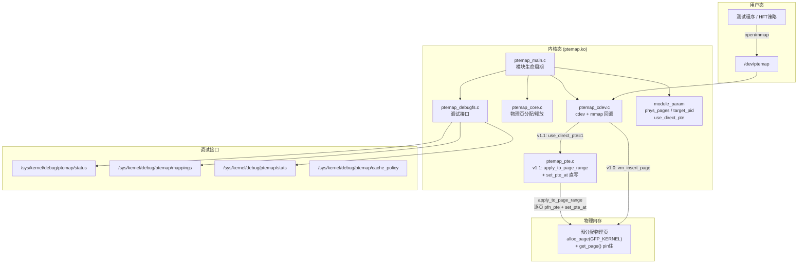
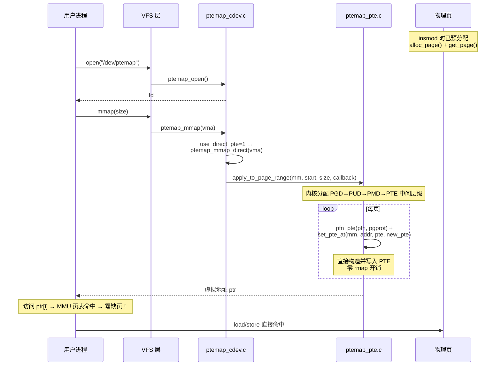
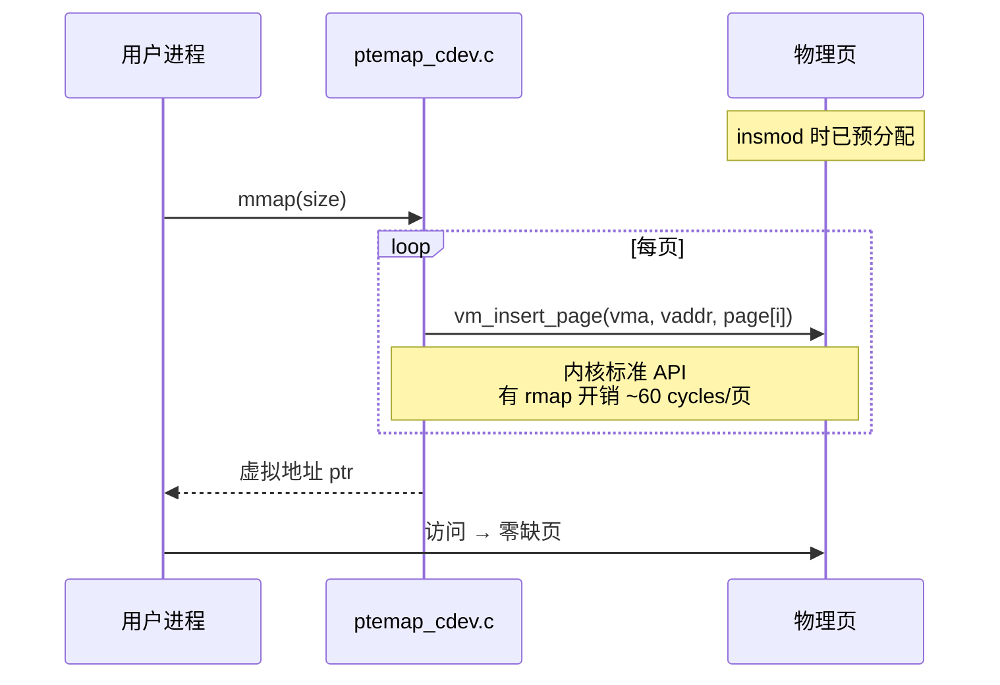
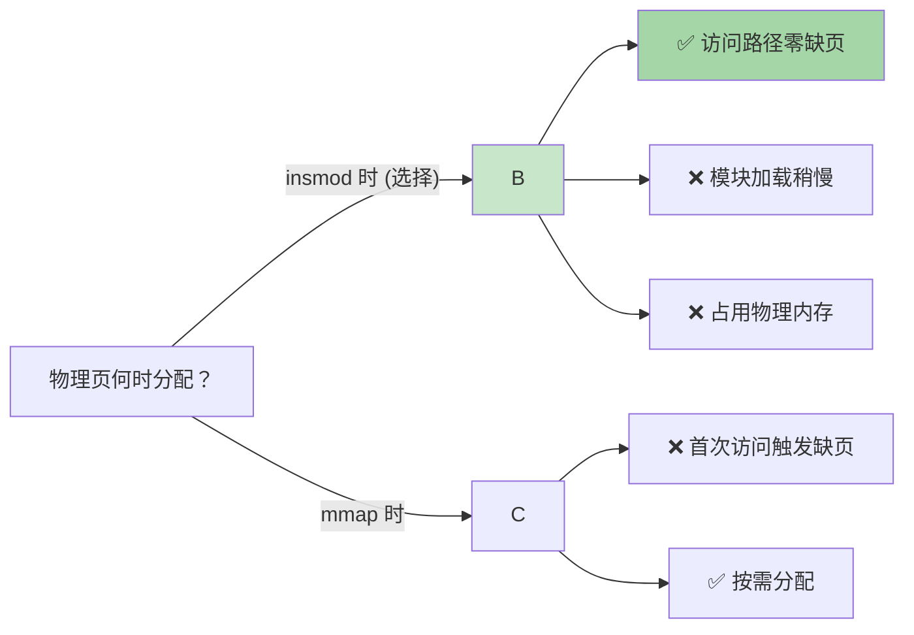

# Zerofault

> 预分配物理页 + 一次 mmap 建立直接映射 → 用户态零缺页访问的 Linux 内核模块

[](https://kernel.org)
[](LICENSE)
[]()
[]()

---

## 解决什么问题

普通 `mmap` 在首次访问每页时触发缺页中断（page fault），逐页分配物理内存并填充 PTE——这对高频交易等低延迟场景不可接受。Zerofault 在 `insmod` 时一次性预分配所有物理页并 pin 住，`mmap` 时直接建立全部映射，用户态访问永不缺页。

```
传统 mmap:  mmap→[缺页→alloc→建PTE→TLB] × N页  (逐页，抖动)
Zerofault:  insmod[预分配全部物理页] → mmap[一次建PTE] → 零缺页访问
```

## 架构总览



## mmap 流程

### v1.1 PTE 直写（默认推荐）



### v1.0 vm_insert_page（兼容保留）



## 源码结构

| 文件 | 行数 | 职责 |
|------|------|------|
| `ptemap_main.c` | 154 | 模块生命周期：init 参数校验 → 找目标进程 → 分配页+缓存数组 → 注册 cdev → 创建 debugfs；exit 逆序清理 |
| `ptemap_core.c` | 109 | 物理页管理：预分配/释放 (`alloc_page`+`get_page`/`put_page`)，Per-page 缓存策略数组分配/释放 |
| `ptemap_cdev.c` | 302 | `/dev/ptemap` 字符设备：open（访问控制）、mmap（v1.0 `vm_insert_page` / v1.1 `apply_to_page_range`）、ioctl（v1.3 QUERY/FLUSH_TLB） |
| `ptemap_pte.c` | 152 | v1.1 PTE 直写 + v1.2 逐页 cache 策略 + v1.3 TLB flush |
| `ptemap_debugfs.c` | 266 | 4 个 debugfs 文件：`status`、`mappings`、`stats`、`cache_policy`（rw，逐页设置 WC/WB/UC/WT） |
| `ptemap_core.h` | 87 | 全局状态结构体 + API 声明 + cache 枚举 + 常量 |
| `ptemap.h` | 88 | UAPI 头文件：ioctl 命令号 + 数据结构，用户态 `#include "ptemap.h"` |
| `test_ptemap.c` | 298 | 用户态测试：open → mmap → 写/读验证 → 跨页边界 → ioctl QUERY → ioctl QUERY_RANGE → ioctl FLUSH_TLB |
| **合计** | **1456** | |

## 模块参数

| 参数 | 类型 | 默认值 | 说明 |
|------|------|--------|------|
| `phys_pages` | int | 256 | 预分配物理页数量（256 = 1MB） |
| `target_pid` | int | 0 | 允许访问的进程 PID（0 = 任意进程） |
| `use_direct_pte` | int | 0 | PTE 直写模式：0=vm_insert_page(v1.0) 1=apply_to_page_range+set_pte_at(v1.1) |

```sh
# v1.0 默认路径（vm_insert_page）
insmod ptemap.ko phys_pages=512 target_pid=0

# v1.1 PTE 直写路径（apply_to_page_range，零 rmap）
insmod ptemap.ko phys_pages=512 use_direct_pte=1
```

## 编译 & 测试

**前置条件**：Linux 6.16.2 内核编译环境，`KERNELDIR` 指向 pre-built kernel tree。

```sh
# ===== 编译 =====
cd ptemap
make KERNELDIR=/path/to/kernel/build

# ===== 加载 =====
insmod ptemap.ko phys_pages=256

# ===== 调试查看 =====
cat /sys/kernel/debug/ptemap/status
#  state:     LIVE
#  version:   1.3.0
#  pages:     256 (total)
#  size:      1048576 bytes (1 MB)
#  target_pid: 0
#  direct_pte: 1 (PTE direct write)
#  vaddr:     0x7f...-0x7f...
#  tlb_flush: 0

cat /sys/kernel/debug/ptemap/cache_policy
#  pages count  mode
#  ----- ------ ------
#  all   256    WC

echo "0-63 WB" > /sys/kernel/debug/ptemap/cache_policy
#  → 前 64 页切换为 Write-Back

cat /sys/kernel/debug/ptemap/mappings
#  idx   vaddr              pfn                 size
#  ----- ------------------ ------------------ ----------
#  0     0x00007f...        0x0000000000123abc 4KB
#  ...

# ===== 运行测试（v1.1 直写路径）=====
insmod ptemap.ko phys_pages=256 use_direct_pte=1
./test_ptemap 64
#  === ptemap test ===
#  device:    /dev/ptemap
#  nr_pages:  64 (256 KB)
#  [1] open  OK (fd=3)
#  ptemap: mmap DIRECT OK: vaddr=0x7f...-0x7f... pages=64 pid=61
#  [2] mmap OK (vaddr=0x7f..., size=256 KB)
#  [3] writing pattern...
#  [3] write OK (64 pages)
#  [4] verifying...
#  [4] verify OK (0 errors)
#  [5] cross-page boundary test...
#  [5] boundary OK
#  --- ioctl QUERY test ---
#    page[  0] pfn=0x5002 vaddr=0x7fc14036c000 cache=0
#    page[  1] pfn=0x4ffb vaddr=0x7fc14036d000 cache=0
#    ...
#  QUERY OK (0 errors)
#  --- ioctl QUERY_RANGE test ---
#  QUERY_RANGE OK (64 pages, 0 errors)
#  --- ioctl FLUSH_TLB test ---
#  FLUSH_TLB OK
#  FLUSH_TLB_RANGE OK (range 0x0-0x1000)
#  === result: PASS ===

# ===== 验证零缺页 =====
perf stat -e page-faults ./test_ptemap 256
#  page-faults: 0  ← 关键指标

# ===== 卸载 =====
rmmod ptemap
```

## 关键设计决策



| 决策 | 选择 | 理由 |
|------|------|------|
| 物理页分配时机 | **insmod 时** | 避免 mmap 后首次访问的缺页延迟抖动 |
| 页映射方式(v1.0) | **vm_insert_page** | 内核标准 API，不用手动走 page table walk |
| 页映射方式(v1.1) | **apply_to_page_range + set_pte_at** | 直写 PTE，零 rmap 开销，逐页独立 pgprot_t 控制 |
| Cache 策略 | **WC 默认，逐页可配** | WC 折中延迟与吞吐，debugfs/ioctl 可查询和设置 WB/UC/WT |
| Cache 属性生效时机 | **mmap 时一锤定音** | 运行时热切需 TLB shootdown + cache flush，HFT 场景不可接受 |
| 调试接口 | **debugfs** | 无 API 兼容性承诺，适合开发期快速迭代 |

## 版本状态

| 版本 | 状态 | 内容 |
|------|------|------|
| v1.0 | 完成 | 模块生命周期、物理页预分配/pin、cdev + mmap (`vm_insert_page`)、debugfs |
| v1.1 | 完成 | PTE 直写 (`apply_to_page_range` + `set_pte_at` + `pfn_pte`)、双路径可切换 (`use_direct_pte`) |
| v1.2 | 完成 | 逐页 cache 策略 (WC/WB/UC/WT)、debugfs `cache_policy` 读写接口 |
| v1.2.1 | 完成 | RSS 计数器修复 (`_PAGE_SPECIAL` bit 9) |
| v1.3 | 完成 | ioctl 查询接口 (`QUERY`/`QUERY_RANGE`)、运行时 TLB flush (`FLUSH_TLB`/`FLUSH_TLB_RANGE`) |

## TODO (v1.4+)

- [ ] **模块卸载安全** — `ptemap_exit()` 回滚 PTE + flush TLB，防止悬挂页表项
- [ ] **Huge page 支持** — 2MB/1GB 大页减少 TLB miss
- [ ] **NUMA 感知** — `alloc_page_node()` 按 NUMA node 分配物理页
- [ ] **insmod 全局 cache_mode 参数** — 设置默认 cache 策略，不必每次通过 debugfs
- [ ] **多进程共享** — `ptemap_share()` 跨进程 mm 共享
- [ ] **性能基准报告** — mmap 延迟对比、读写吞吐、TLB miss rate

## License

GPL-2.0
