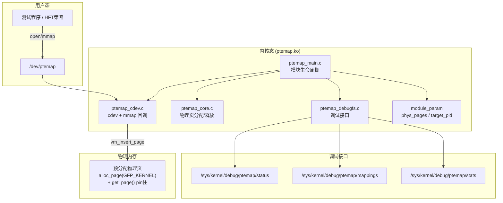
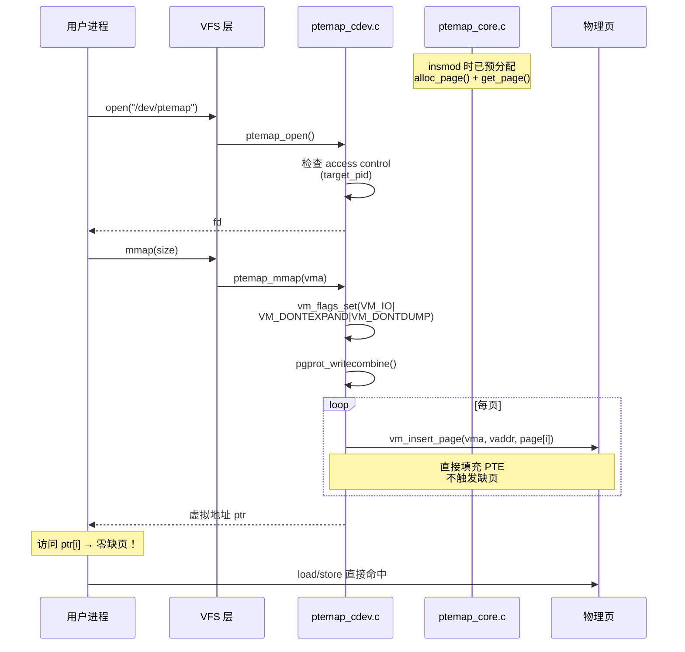
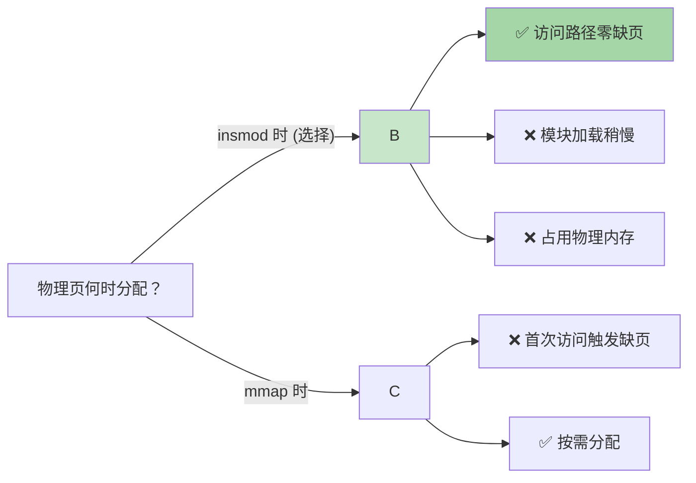

# Zerofault

> 预分配物理页 + 一次 mmap 建立直接映射 → 用户态零缺页访问的 Linux 内核模块

[](https://kernel.org)
[](LICENSE)
[]()

---

## 解决什么问题

普通 `mmap` 在首次访问每页时触发缺页中断（page fault），逐页分配物理内存并填充 PTE——这对高频交易等低延迟场景不可接受。Zerofault 在 `insmod` 时一次性预分配所有物理页并 pin 住，`mmap` 时直接建立全部映射，用户态访问永不缺页。

```
传统 mmap:  mmap→[缺页→alloc→建PTE→TLB] × N页  (逐页，抖动)
Zerofault:  insmod[预分配全部物理页] → mmap[一次建PTE] → 零缺页访问
```

## 架构总览



## mmap 流程



## 源码结构

| 文件 | 行数 | 职责 |
|------|------|------|
| `ptemap_main.c` | 145 | 模块生命周期：init 参数校验 → 找目标进程 → 分配页 → 注册 cdev → 创建 debugfs；exit 逆序清理 |
| `ptemap_core.c` | 66 | 物理页管理：`kcalloc` 分配 page 指针数组 → `alloc_page(GFP_KERNEL)` + `get_page()` pin 页 → `put_page()` + `kfree` 释放 |
| `ptemap_cdev.c` | 151 | `/dev/ptemap` 字符设备：open（访问控制）、mmap（`vm_insert_page` 建映射）、ioctl（v1.1 预留） |
| `ptemap_debugfs.c` | 133 | 3 个 debugfs 文件：`status`（模块状态）、`mappings`（每页 VA/PFN 表）、`stats`（内存统计） |
| `ptemap_core.h` | 61 | 全局状态结构体 + API 声明 + 常量定义 |
| `test_ptemap.c` | 127 | 用户态测试：open → mmap → 写 pattern → 读验证 → 跨页边界测试 |

## 模块参数

| 参数 | 类型 | 默认值 | 说明 |
|------|------|--------|------|
| `phys_pages` | int | 256 | 预分配物理页数量（256 = 1MB） |
| `target_pid` | int | 0 | 允许访问的进程 PID（0 = 任意进程） |

```sh
# 仅 root 可访问
insmod ptemap.ko phys_pages=512 target_pid=0
```

## 编译 & 测试

**前置条件**：Linux 6.16.2 内核编译环境，`KERNELDIR` 指向 pre-built kernel tree。

```sh
# ===== 编译 =====
cd ptemap
make KERNELDIR=/path/to/kernel/build

# ===== 加载 =====
insmod ptemap.ko phys_pages=256

# ===== 调试查看 =====
cat /sys/kernel/debug/ptemap/status
#  state:     LIVE
#  version:   1.0.0
#  pages:     256 (total)
#  size:      1048576 bytes (1 MB)
#  target_pid: 0
#  vaddr:     0x7f...-0x7f...
#  tlb_flush: 0

cat /sys/kernel/debug/ptemap/mappings
#  idx   vaddr              pfn                 size
#  ----- ------------------ ------------------ ----------
#  0     0x00007f...        0x0000000000123abc 4KB
#  ...

# ===== 运行测试 =====
gcc -static -O2 -o test_ptemap test_ptemap.c
./test_ptemap 64
#  === ptemap test ===
#  [1] open  OK
#  [2] mmap OK
#  [3] write OK
#  [4] verify OK (0 errors)
#  [5] boundary OK
#  === result: PASS ===

# ===== 验证零缺页 =====
perf stat -e page-faults ./test_ptemap 256
#  page-faults: 0  ← 关键指标

# ===== 卸载 =====
rmmod ptemap
```

## 关键设计决策



| 决策 | 选择 | 理由 |
|------|------|------|
| 物理页分配时机 | **insmod 时** | 避免 mmap 后首次访问的缺页延迟抖动 |
| 页映射方式 | **vm_insert_page** | 内核标准 API，不用手动走 page table walk |
| Cache 策略 | **writecombine** | UC 太慢，WB 有 cache 一致性开销，WC 折中 |
| 调试接口 | **debugfs** | 无 API 兼容性承诺，适合开发期快速迭代 |

## TODO (v1.1+)

- [ ] **PTE 直写** — 绕过 `vm_insert_page`，手动 page table walk 直接写 PTE（更贴近原始方案目标）
- [ ] **ioctl 查询接口** — 查询映射信息、TLB flush 控制
- [ ] **NUMA 感知** — `alloc_page_node()` 按 NUMA node 分配
- [ ] **Huge page 支持** — 2MB/1GB 大页减少 TLB 压力
- [ ] **性能基准报告** — mmap 延迟、读写吞吐、TLB miss rate vs 普通 malloc

## License

GPL-2.0
